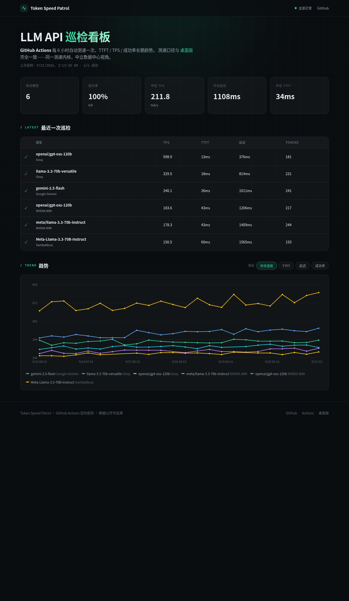

# Token Speed

适合个人使用的 LLM API 延迟与速度检测工具。监控多提供商的 TTFT / TPS / 思考时长 / token 拆分。

**一个仓库，两种部署：**

| | 桌面版 / 全栈版 | GitHub Actions 巡逻版 |
|---|---|---|
| 形态 | FastAPI + SQLite + React 桌面应用 | GitHub Actions cron + JSONL + 静态看板 |
| 数据落地 | 本地 SQLite | 仓库内 JSONL（commit 回仓库） |
| 入口 | `TokenSpeed.exe` / `uvicorn` | GitHub Pages 静态看板 |
| 适合 | 自测、多服务商管理、定时测速 | 公开监控免费 LLM API 的速度与可用性 |
| 共用 | **同一测速内核** `backend/speed_test.py` | **同一测速内核** |

两种部署**数据独立、不合并**：桌面版看自己的 SQLite，巡逻看板看自己的 JSONL。测速内核通过 sink callback 解耦数据落地——内核不感知数据去向，桌面版注入 `sqlite_sink`，巡逻注入 `json_sink`。

[](LICENSE)




---

## 一、GitHub Actions 巡逻版（免服务器）

Fork 仓库 → 配置 Secrets → 启用 workflow → 看板自动跑起来。无需任何服务器。

### 1. Fork 并配置 API 密钥

在 **你的 fork 仓库 → Settings → Secrets and variables → Actions** 添加以下 secrets（按 [`config/patrol.json`](config/patrol.json) 中 `api_key_env` 字段名一一对应）：

| Secret 名 | 从哪获取密钥 |
|---|---|
| `GROQ_API_KEY` | [console.groq.com/keys](https://console.groq.com/keys) — 永久免费层，无需信用卡 |
| `NVIDIA_API_KEY` | [build.nvidia.com](https://build.nvidia.com/settings) — 免费试用额度，无需信用卡 |
| `GEMINI_API_KEY` | [aistudio.google.com](https://aistudio.google.com/apikey) — 免费层，无需信用卡 |
| `CLOUDFLARE_API_KEY` | [Cloudflare API Token](https://developers.cloudflare.com/fundamentals/api/get-started/create-token/) — 10K Neurons/天免费层，无需信用卡 |
| `OPENROUTER_API_KEY` | [openrouter.ai/keys](https://openrouter.ai/keys) — `:free` 模型免费（50 请求/天） |
| `MODELSCOPE_API_KEY` | [modelscope.cn](https://modelscope.cn/my/mykeys) — 2000 次/天，需实名 |
| `KILO_API_KEY` | 固定填 `none` — [Kilo Gateway](https://kilo.ai) 匿名免费层，无需注册 |

巡逻目标已内置为「2026 年仍值得一用的免费 LLM API」：Groq、NVIDIA NIM、Google Gemini、Cloudflare Workers AI、OpenRouter、ModelScope、Kilo Gateway。密钥**绝不落盘**——`patrol.json` 只存环境变量名，巡逻 runner 从 `os.environ` 解析，结果 JSON 不含 `api_key`。

### 2. 启用两个 workflow

| Workflow | 作用 |
|---|---|
| **Token Speed Patrol** (`.github/workflows/patrol.yml`) | 每 6 小时测速一次，结果 commit 回 `website/patrol/data/` |
| **Deploy website** (`.github/workflows/deploy-website.yml`) | push master 自动发布 GitHub Pages |

到 **Settings → Pages → Build and deployment → Source: GitHub Actions** 启用 Pages。

### 3. 触发首次巡逻

**Actions → Token Speed Patrol → Run workflow** 手动触发一次，确认产出 `website/patrol/data/YYYY-MM-DD.jsonl`。之后看板地址（`https://<你的用户名>.github.io/token-speed/patrol/`）即开始展示趋势。

### 自定义巡逻目标

编辑你 fork 的 `config/patrol.json`（结构见 [`config/patrol.json.example`](config/patrol.json.example)）：

```json
{
  "prompt": "Hello, tell me a short story in 3 sentences.",
  "max_tokens": 256,
  "stream": true,
  "targets": [
    {
      "provider_name": "你的服务商名",
      "base_url": "https://api.xxx.com/v1",
      "api_key_env": "YOUR_SECRET_NAME",
      "protocol": "openai",
      "models": ["model-id-1", "model-id-2"]
    }
  ]
}
```

`protocol` 支持 `openai` 与 `anthropic`（Anthropic 原生端点用 `anthropic`）。新增服务商时，记得在 `patrol.yml` 的 `env:` 段加上对应的 `${{ secrets.XXX }}` 映射。

---

## 二、桌面版 / 全栈版

### 下载（Windows 免环境）

从 [GitHub Releases](https://github.com/john-walks-slow/token-speed/releases) 下载 `TokenSpeed-vX.X.X-win64.zip`，解压双击 `TokenSpeed.exe` 即可（免 Python / Node）。数据保存在 `%APPDATA%\TokenSpeed\`，托盘图标可最小化/退出，`--hidden` 参数支持开机自启。

### 源码运行

```bash
pip install -r backend/requirements.txt
cd frontend && npm install && cd ..
python -m uvicorn backend.main:app --reload --port 8000   # 后端
cd frontend && npm run dev   # 前端 5173，vite 代理 /api → 8000
```

打开 http://localhost:5173。

### 功能

- **多服务商管理**：添加/编辑/删除服务商，检测并缓存模型列表。
- **批量测速**：跨服务商、多模型选择，支持流式/非流式，并发 + 迭代控制，SSE 实时进度、可中途取消。
- **Provider 感知统计**：统计、结果、历史按 (provider, model) 对聚合——多个 provider 提供同一 modelid 时分开展示为 `model (provider名)`。
- **成功率统计**：横向 bar chart 按 (provider, model) 统计 `成功/全部`，bar 上显示 `rate% (成功/总数)`，范围跟随时间与模型筛选。
- **回复内容查看**：每次测速保存实际回复正文，进度/结果/历史 hover 图标即可查看。
- **定时测速**：按间隔自动执行，支持运行时参数（并发、迭代、关闭推理、RPM 限流）。
- **历史与统计**：时间序列趋势（小多图/单图）、模型对比、成功率、TTFT/延迟/TPS 指标切换。

### 打包与发布（Windows）

```bash
pip install pyinstaller
python build.py --zip   # 构建前端 + PyInstaller 打包 + 压缩
# 产物：dist/TokenSpeed/ 与 dist/TokenSpeed-v<版本>-win64.zip
```

打 tag（`v*`）推送后，GitHub Actions 会自动在 Windows 上打包并附到 Release。

### 管理密码（单端口只读 + 登录）

应用默认仅绑定 `127.0.0.1`，未配置密码时全功能即可用（向后兼容）。配置管理密码后，主端口未登录时直接展示**只读统计视图**（统计 + 历史，无任何管理功能，不暴露 API key）；登录后进入完整管理界面。

| 环境变量 | 默认 | 说明 |
|---|---|---|
| `TOKEN_SPEED_ADMIN_PASSWORD` | 未设 | 管理密码；配置后管理功能需登录，统计/历史/只读视图免密 |
| `TOKEN_SPEED_ADMIN_PASSWORD`（桌面） | — | 也可用 `TokenSpeed.exe --admin-password X` 传入 |

手机/局域网浏览器访问 `http://<本机IP>:8000/` 默认看到只读统计视图（管理接口仍需登录）。

---

## 技术栈

- **测速内核**：`backend/speed_test.py` — httpx 流式/非流式，OpenAI/Anthropic 协议，`_reconcile_token_counts` 统一 usage 口径。`execute_batch_tests` 通过 sink callback 解耦数据落地。
- **桌面版**：FastAPI + SQLite + httpx，asyncio 调度器，SSE 流式推送。
- **前端**：React 19 + TypeScript + Vite + Tailwind v4 + Recharts，shadcn/ui 风格组件。
- **巡逻看板**：`website/patrol/index.html` — 零构建纯 JS + 原生 Canvas 图表，与桌面版共享深色主题。

## 目录结构

```
backend/
  speed_test.py      # 测速核心（sink callback 解耦；两套部署共用）
  main.py            # FastAPI 主应用（桌面版 adapter，传 sqlite_sink）
  patrol_config.py   # 巡逻配置契约（PatrolConfig，core 层同构不同源）
  patrol_runner.py   # 巡逻入口（python -m backend.patrol_runner，传 json_sink）
  scheduler.py       # 桌面版定时调度
  database.py        # SQLite 访问 + schema 迁移
config/
  patrol.json         # 巡逻配置（fork 后改这个 + 填 secrets）
  patrol.json.example # 配置示例
website/
  patrol/index.html   # 巡逻看板（零构建），GitHub Pages 唯一入口
  patrol/data/        # 巡逻 JSONL 结果（workflow 自动 commit）
.github/workflows/
  patrol.yml          # 巡逻 cron（每6h）+ 结果 commit
  deploy-website.yml  # GitHub Pages 部署
  release.yml         # tag v* 触发 Windows 打包
```

## 文档

功能开发记录见 `docs/features/`（plan / validation / review / summary）。模块级指引见 `AGENTS.md`。

## License

[MIT](LICENSE)
