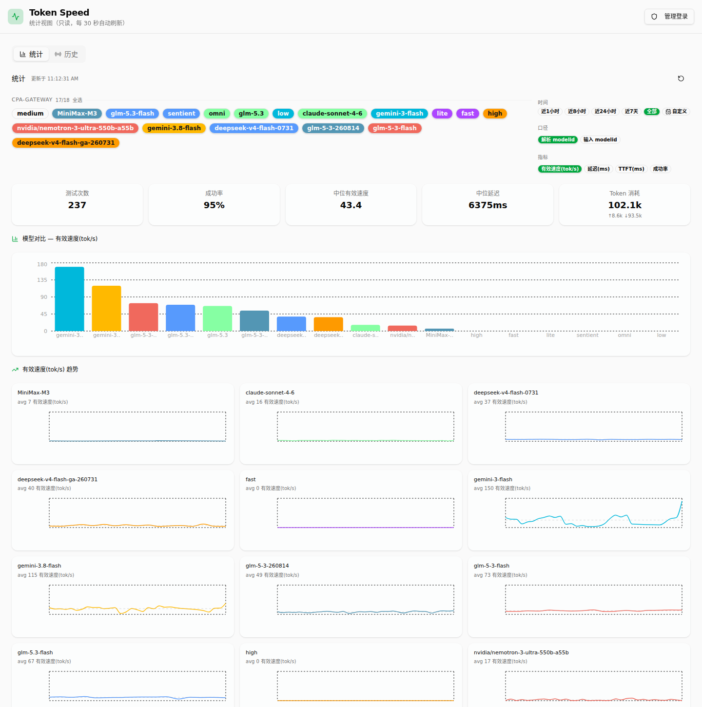

# Token Speed

适合个人使用的 LLM API 延迟与速度检测工具。监控多提供商的 TTFT / TPS / 思考时长 / token 拆分。

> 🛰️ **免服务器巡检版已独立成仓**：[token-speed-patrol](https://github.com/john-walks-slow/token-speed-patrol) — GitHub Actions 定时测速 + 静态看板，fork 自用。两仓库共用同一测速内核。

[](LICENSE)



---

## 桌面版 / 全栈版

### 下载

从 [GitHub Releases](https://github.com/john-walks-slow/token-speed/releases) 下载 `TokenSpeed-vX.X.X-win64.zip`，解压双击 `TokenSpeed.exe` 即可（免 Python / Node）。数据保存在 `%APPDATA%\TokenSpeed\`，托盘图标可最小化/退出，`--hidden` 参数支持开机自启。

### 源码运行

```bash
pip install -r backend/requirements.txt
cd frontend && npm install && cd ..
python -m uvicorn backend.main:app --reload --port 8000   # 后端
cd frontend && npm run dev   # 前端 5173，vite 代理 /api → 8000
```

打开 http://localhost:5173。

### 功能

- **多服务商管理**：添加/编辑/删除服务商，检测并缓存模型列表。
- **批量测速**：跨服务商、多模型选择，支持流式/非流式，并发 + 迭代控制，SSE 实时进度、可中途取消。
- **Provider 感知统计**：统计、结果、历史按 (provider, model) 对聚合——多个 provider 提供同一 modelid 时分开展示为 `model (provider名)`。
- **成功率统计**：横向 bar chart 按 (provider, model) 统计 `成功/全部`，bar 上显示 `rate% (成功/总数)`，范围跟随时间与模型筛选。
- **回复内容查看**：每次测速保存实际回复正文，进度/结果/历史 hover 图标即可查看。
- **定时测速**：按间隔自动执行，支持运行时参数（并发、迭代、关闭推理、RPM 限流）。
- **历史与统计**：时间序列趋势（小多图/单图）、模型对比、成功率、TTFT/延迟/TPS 指标切换。

### 打包与发布（Windows）

```bash
pip install pyinstaller
python build.py --zip   # 构建前端 + PyInstaller 打包 + 压缩
# 产物：dist/TokenSpeed/ 与 dist/TokenSpeed-v<版本>-win64.zip
```

打 tag（`v*`）推送后，GitHub Actions 会自动在 Windows 上打包并附到 Release。

### 管理密码（单端口只读 + 登录）

应用默认仅绑定 `127.0.0.1`，未配置密码时全功能即可用（向后兼容）。配置管理密码后，主端口未登录时直接展示**只读统计视图**（统计 + 历史，无任何管理功能，不暴露 API key）；登录后进入完整管理界面。

| 环境变量 | 默认 | 说明 |
|---|---|---|
| `TOKEN_SPEED_ADMIN_PASSWORD` | 未设 | 管理密码；配置后管理功能需登录，统计/历史/只读视图免密 |
| `TOKEN_SPEED_ADMIN_PASSWORD`（桌面） | — | 也可用 `TokenSpeed.exe --admin-password X` 传入 |

手机/局域网浏览器访问 `http://<本机IP>:8000/` 默认看到只读统计视图（管理接口仍需登录）。

---

## 技术栈

- **测速内核**：`backend/speed_test.py` — httpx 流式/非流式，OpenAI/Anthropic 协议，`_reconcile_token_counts` 统一 usage 口径。网络参数（client_kwargs）由调用方注入，core 层无存储依赖。
- **桌面版**：FastAPI + SQLite + httpx，asyncio 调度器，SSE 流式推送。
- **前端**：React 19 + TypeScript + Vite + Tailwind v4 + Recharts，shadcn/ui 风格组件。

## 目录结构

```
backend/
  speed_test.py      # 测速核心（client_kwargs 注入；与 token-speed-patrol 同源）
  main.py            # FastAPI 主应用（adapter 层，注入 client_kwargs 与 sqlite_sink）
  scheduler.py       # 定时调度
  database.py        # SQLite 访问 + schema 迁移
.github/workflows/
  release.yml        # tag v* 触发 Windows 打包
```

## 文档

功能开发记录见 `docs/features/`（plan / validation / review / summary）。模块级指引见 `AGENTS.md`。

## 外链

[linux.do](linux.do)

## License

[MIT](LICENSE)
